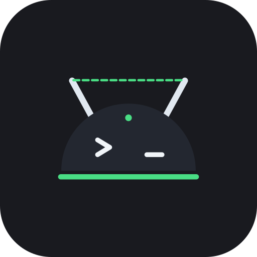

<p align="center"></p>

# DevSwitch

A small Android app that switches **Developer options**, **USB debugging** and
**Wireless debugging** on and off, from a screen with three switches and from three
Quick Settings tiles.

Android only. iOS has no equivalent: apps cannot touch Developer Mode there.

## Why a one-time setup step is unavoidable

The three switches are values in the system settings database:

| Switch             | `Settings.Global` key           | Min. Android |
|--------------------|---------------------------------|--------------|
| Developer options  | `development_settings_enabled`  | any          |
| USB debugging      | `adb_enabled`                   | any          |
| Wireless debugging | `adb_wifi_enabled`              | 11           |

Anyone can *read* them. *Writing* them needs `WRITE_SECURE_SETTINGS`, a
`signature|privileged|development` permission that the OS never offers in a permission
dialog. Its `development` flag is the loophole: the shell user (what `adb shell` and Shizuku
run as) may grant it to any app that declares it in its manifest. Once granted it stays granted
across reboots and updates; only uninstalling the app revokes it.

So the app works like every other "toggle a secure setting" app on the market: it declares the
permission, you grant it once, and from then on it writes the settings directly. The system
reacts on its own: `AdbService` watches `adb_enabled` and `adb_wifi_enabled` and starts or stops
the daemon, and the Settings app reads `development_settings_enabled` to show or hide the
Developer options screen.

## Setup

1. Build and install (see below), then open the app. It shows a red "One-time setup needed"
   card until the permission is present.
2. Grant `WRITE_SECURE_SETTINGS` in one of three ways:

   **a. From a computer with ADB** (USB debugging must be on for this one step):

   ```sh
   adb shell pm grant app.devswitch android.permission.WRITE_SECURE_SETTINGS
   ```

   The setup card has a "Copy command" button.

   **b. On the phone with [Shizuku](https://shizuku.rikka.app/)** (Android 11+, no computer):
   install Shizuku, start it through its wireless-debugging flow, then tap *Grant with
   Shizuku* in the app. The app spins up a short-lived Shizuku user service (shell uid),
   runs the same `pm grant` command, and shuts the service down again.

   **c. With root:** tap *Grant with root*. The app runs `pm grant` through `su`.

3. Reopen the app. The card turns into "Ready" and the switches become active. The tiles
   (Developer options, USB debugging, Wireless debugging) can now be added from the Quick
   Settings tile editor.

## Behaviour worth knowing

- Turning **Developer options off** also turns USB and wireless debugging off, the same as
  the master switch in the Settings app does. Turning it on changes nothing else.
- The first time wireless debugging is enabled on a given Wi-Fi network, Android shows its
  own "Allow wireless debugging on this network?" dialog, exactly as it does for the switch in
  Settings. The setting only becomes active once that is accepted; tick "Always allow on this
  network" and it will not ask again for that network.
- **Wireless debugging** needs an active Wi-Fi connection. If Wi-Fi is off or drops, Android
  flips the setting back to off by itself, and the app's switch follows because it observes
  the setting rather than remembering what it last wrote.
- Turning on USB or wireless debugging does not authorize anything: a new computer still gets
  the RSA fingerprint prompt, and wireless debugging still needs pairing.
- The tiles refuse to toggle on a locked screen and ask for unlock first, so a debugging
  channel cannot be opened from the lock screen.
- Turning a switch off, or unpairing a computer, asks first, because either can cut the
  connection a computer is using right now. Turning something on never asks.
- The screen stays on while a pairing offer or the camera scanner is open, since some builds drop
  wireless debugging the moment the screen sleeps.
- A pairing in progress survives switching tabs; it ends only on Stop, completion or a timeout.
- Beyond WRITE_SECURE_SETTINGS, the app declares only ACCESS_NETWORK_STATE, used by the Wireless
  tab to tell Wi-Fi from Ethernet. Discovery of adb endpoints goes through the system's mDNS
  service and the device's own IP comes from its interfaces, so the app opens no sockets and does
  not hold INTERNET. No location permission is requested, so no Wi-Fi network name is read.

## Tested

On an Android 16 (API 36) x86_64 emulator: install, the ADB grant, the permission surviving an
app update, the screen noticing a grant made while it is open, Developer options and wireless
debugging toggled from the switches and from the Quick Settings tile, the system's wireless
debugging dialog, and the cascade when Developer options is turned off (the emulator's ADB
link dropped, which is the daemon stopping). The Shizuku and root paths could not be exercised
there because the emulator image has neither.

## Known limits

- **Managed devices:** if the `DISALLOW_DEBUGGING_FEATURES` restriction is set (work profile,
  device owner), the settings provider rejects enabling any of the three, even with the
  permission.
- **Xiaomi / HyperOS:** `pm grant` over ADB only works after enabling
  *USB debugging (Security settings)* in Developer options.
- **Emulators:** turning USB debugging off on an emulator drops the ADB connection to it, which
  is exactly what the switch is supposed to do, but there is no way back without the emulator
  window.
- Shizuku started through wireless debugging stops on reboot; that does not matter here
  because it is only used for the one-time grant.

## Building

Native Kotlin + Jetpack Compose, single module.

- Android Gradle Plugin 9.3.2, Gradle 9.7.1, Kotlin 2.4.10 (AGP built-in Kotlin), compileSdk 37,
  minSdk 26, targetSdk 36.
- Needs a JDK 17 or newer to run Gradle. On this machine Android Studio's bundled JDK works:
  `JAVA_HOME=/opt/android-studio/jbr ./gradlew assembleDebug`
- `local.properties` points `sdk.dir` at the Android SDK (created for this machine, not
  committed).

```sh
./gradlew assembleDebug          # app/build/outputs/apk/debug/app-debug.apk
./gradlew assembleRelease        # minified with R8; unsigned until a signing config is added
adb install -r app/build/outputs/apk/debug/app-debug.apk
./gradlew testDebugUnitTest      # unit tests for the QR parser, paired-device decoding, address logic
```

## Wireless tab

A second tab mirrors what Android's own Wireless debugging screen shows.

- **This device** reads the phone's own IPv4 addresses, across every interface so the Wi-Fi
  address is still found when a VPN owns the default route, and shows the live wireless debugging
  address and pairing port as adb announces them over mDNS.
- **Pair a computer** works two ways. *Pair with code* shows an `adb pair <host:port>` command and
  a six-digit code: run it on the computer, or in Android Studio use Pair using pairing code, pick
  the device and type the code. *Scan Studio QR* opens the camera to read the QR that Android
  Studio's Pair using QR code shows; the phone then advertises under the name carried in that QR, so
  Studio connects and finishes. Both drive the same framework call, with the code the app generates
  or the values it scanned. The phone never displays a QR, because Android Studio shows the QR and
  the phone is the side that scans it.
- **Paired computers** lists the computers already paired, with an Unpair action.
- **On this network** is a live mDNS scan of adb endpoints on the Wi-Fi, this device included.

### Why pairing needs Shizuku

Generating the pairing code drives the framework's hidden `android.debug.IAdbManager`, whose calls
require the `MANAGE_DEBUGGING` permission that only the shell and system identities hold. The app's
own process cannot even look up the adb service, because its SELinux context is denied that, so the
whole interaction runs inside a Shizuku user service: a process Shizuku spawns with the shell
identity and SELinux context. There it looks up the adb service and reflects on the device's own
`IAdbManager$Stub`, so the binder transaction codes always match the running platform even though
the API changed shape at Android 13.

The framework reports a completed pairing through a broadcast that also requires MANAGE_DEBUGGING to
*receive*, which the app's own process does not hold, so the app cannot listen for it. Instead it
watches two things: a new fingerprint in `getPairedDevices()`, which means a new computer paired,
and the pairing service vanishing from mDNS, which adbd drops the moment pairing ends, so completion
is seen even when the computer was already paired. The shell service stays bound for the whole
session, so a pairing costs one process rather than one per poll.

When Shizuku is not running, the Pair card explains this and offers a button that opens Android's own
Developer options, where pairing works without the app. Device discovery and the address readouts need
no privilege and work regardless.

### Known caveats

- Pairing was verified end to end through Shizuku on an Android 16 (iQOO / Vivo OriginOS) phone: the
  app generated the QR and code, the phone advertised the pairing service, and `adb pair` against the
  shown endpoint and code succeeded. The reflection is written against AOSP for Android 11 through 16
  and degrades to a clear message on failure rather than crashing.
- Heavily modified ROMs (Xiaomi HyperOS, Vivo/iQOO OriginOS and Funtouch, ColorOS) can gate or limit
  wireless debugging and may restrict mDNS. The API shape itself is inherited from AOSP, so the calls
  are expected to work where wireless debugging itself does.

## Icon

The launcher icon is an adaptive icon built from vector drawables in `app/src/main/res`, with a
monochrome layer for themed icons on Android 13 and later. `art/icon.svg` is the master and
`art/icon-512.png` is the full-bleed square a store listing needs (Google Play rounds it itself), and
`art/icon-rounded.png` is the same artwork with rounded corners for pages like this one.

## Layout

```
app/src/main/
├── AndroidManifest.xml                 permission, Shizuku provider, three tile services
├── aidl/.../IShellService.aidl         interface of the Shizuku user service
└── java/app/devswitch/
    ├── DevSettings.kt                  read / write / observe the three settings
    ├── MainViewModel.kt                switches UI state, toggling, the three grant paths
    ├── WirelessViewModel.kt            discovery, this device's address, pairing
    ├── MainActivity.kt
    ├── privilege/RootGrant.kt          `su -c pm grant ...`
    ├── shizuku/ShizukuBridge.kt        Shizuku status, permission, user-service call
    ├── shizuku/ShellService.kt         shell-uid process: runs commands and the IAdbManager pairing calls
    ├── wireless/DeviceDiscovery.kt     mDNS scan for adb endpoints
    ├── wireless/WirelessInfo.kt        this device's IPv4 addresses
    ├── wireless/AdbPairingQr.kt        parses the WIFI:T:ADB pairing QR
    ├── wireless/PairedDevice.kt        a paired computer, decoded from the shell service
    ├── wireless/QrImage.kt             QR bitmap for the pairing code
    ├── tiles/ToggleTileService.kt      Quick Settings tiles
    └── ui/                             Compose screens (Switches and Wireless tabs) and theme
```

Unit tests for the pure pieces, the QR parser, paired-device decoding and the address logic, live
under `app/src/test/java/app/devswitch/wireless/`. The device-only parts (Shizuku, the hidden
adb service, mDNS, the camera) are verified on a phone rather than in unit tests.

## Releasing and F-Droid

The build is set up the way F-Droid's reproducible-build check needs it: the release APK is signed
only when a gitignored `keystore.properties` is present (see `keystore.properties.example`) and is
left unsigned otherwise, never signed with the debug key, and Google Play's encrypted dependency blob
is left out of every artifact.

To cut a release, build with JDK 17 (what F-Droid's build server uses) with
`./gradlew clean assembleRelease`, tag the commit `vX.Y` and push the tag, then create a GitHub
release for it and attach the APK as `DevSwitch-X.Y.apk`. The listing text, changelog, icon and
screenshots F-Droid shows live in `fastlane/metadata/android/en-US/`. A ready-to-submit
`fdroiddata` entry and the step-by-step submission are in [`fdroid/`](fdroid/).

## License

DevSwitch is free software under the GNU General Public License, version 3 or later
(SPDX-License-Identifier: `GPL-3.0-or-later`). See [LICENSE](LICENSE) for the full text.

The bundled dependencies (Jetpack Compose, CameraX, ZXing, Shizuku, HiddenApiBypass) are under the
Apache License 2.0.
